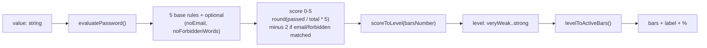

<div align="center">

# pass-strength-indicator

<p align="center">
  <a href="https://www.npmjs.com/package/pass-strength-indicator"></a>
  <a href="https://www.npmjs.com/package/pass-strength-indicator"></a>
  <a href="https://github.com/SamuelPrigent/pass-strength-indicator/blob/main/LICENSE"></a>
  =18">
  
</p>

🔐 <strong>A lightweight, accessible password-strength indicator for React.</strong>

<p align="center">
  <a href="#features">Features</a> •
  <a href="#installation">Installation</a> •
  <a href="#quick-start">Quick Start</a> •
  <a href="#examples">Examples</a> •
  <a href="#languages">Languages</a> •
  <a href="#how-it-works">How it works</a> •
  <a href="#props">Props</a> •
  <a href="#license">License</a>
</p>

<a href="https://shadcn-pass-strength.vercel.app"></a>

</div>

## Features

- **Indicator-only** — bring your own input; the component renders the bar and rules
- **13 languages** out of the box (en, fr, es, de, pt, it, nl, pl, sv, uk, zh, ja, ko)
- **2 bar modes** — segmented (`default`) or continuous (`full`)
- **3, 4, or 5** strength levels
- **Configurable rules** — from `0` (bar-only) up to all rules via `maxRules`
- **Email-pattern detection** — blocks 4+ consecutive chars from the email
- **Forbidden words** — block specific words
- **Dark mode** out of the box
- **Fully typed** with TypeScript
- **Headless hook** (`usePasswordStrength`) for custom UI
- **Lightweight** — 1 runtime dependency (`clsx`)

## Prerequisites

| Dependency                              | Version  | Required |
| --------------------------------------- | -------- | :------: |
| [React](https://react.dev)              | >= 18    |    ✅    |
| react-dom                               | >= 18    |    ✅    |
| [Tailwind CSS](https://tailwindcss.com) | v3 or v4 |    ✅    |

> The component renders Tailwind utility classes, so Tailwind must be set up in your app. It ships as ES2017 and only needs React at runtime; Node.js >= 18 is recommended for your build tooling.

## Installation

```bash
# 1. Install Tailwind CSS (if not already set up)
# https://tailwindcss.com/docs/installation

# 2. Install the package
npm install pass-strength-indicator
```

## Quick Start

```tsx
import { useState } from "react";
import { PasswordStrength } from "pass-strength-indicator";

export function PasswordForm() {
  const [password, setPassword] = useState("");

  return (
    <div className="space-y-2">
      {/* Your input */}
      <input
        type="password"
        value={password}
        onChange={(e) => setPassword(e.target.value)}
      />
      {/* The strength indicator */}
      <PasswordStrength value={password} />
    </div>
  );
}
```

## Examples

### Bar Only Mode

Set `maxRules={0}` to hide validation rules and show only the strength bar:

```tsx
<PasswordStrength value={password} maxRules={0} />
```

### Full Bar Mode

Use `barMode="full"` for a continuous bar instead of segmented bars:

```tsx
<PasswordStrength value={password} barMode="full" />
```

### Email Pattern Detection

Prevents users from including any 4+ consecutive characters from their email:

```tsx
<PasswordStrength value={password} email="johndoe@example.com" />
```

### Custom Number of Bars

Choose between 3, 4, or 5 strength bars:

```tsx
<PasswordStrength value={password} barsNumber={3} maxRules={0} />
```

### Indicator Background

Add a card background around the indicator section. Independent from `barMode`.

```tsx
{
  /* Tailwind classes */
}
<PasswordStrength
  value={password}
  indicatorBackground="bg-zinc-100 dark:bg-zinc-900"
/>;

{
  /* CSS colors (light/dark) */
}
<PasswordStrength
  value={password}
  indicatorBackground={{ light: "#f5f5f5", dark: "#1c1c1c" }}
/>;
```

### Full Configuration

```tsx
<PasswordStrength
  value={password}
  locale="fr"
  barMode="full"
  indicatorBackground="bg-zinc-100 dark:bg-zinc-900"
  barsNumber={5}
  maxRules={3}
  email="user@example.com"
  forbiddenWords={["password", "company"]}
/>
```

### Score required

Need to gate a form on the password strength? Read the live score with the `usePasswordStrength` hook (the headless side of the library), feed it the same `password` state as the indicator, and disable your button until the score is high enough.

```tsx
import { useState } from "react";
import { PasswordStrength, usePasswordStrength } from "pass-strength-indicator";

export function LoginForm() {
  const [password, setPassword] = useState("");

  // Same state as the input, so the score stays in sync
  const { score } = usePasswordStrength(password);

  return (
    <form className="space-y-2">
      <input
        type="password"
        value={password}
        onChange={(e) => setPassword(e.target.value)}
      />
      <PasswordStrength value={password} />

      <button type="submit" disabled={score < 4}>
        Log in
      </button>
    </form>
  );
}
```

> Prefer a plain function (no React)? `evaluatePassword(password)` returns `{ passedRules, failedRules, score }` and runs anywhere.

## Languages

13 locales are bundled, with no extra setup. Pass one via the `locale` prop:

```tsx
<PasswordStrength value={password} locale="fr" />
```

| Flag | Language   | `locale` |
| :--: | ---------- | -------- |
|  🇬🇧  | English    | `en`     |
|  🇫🇷  | Français   | `fr`     |
|  🇪🇸  | Español    | `es`     |
|  🇩🇪  | Deutsch    | `de`     |
|  🇵🇹  | Português  | `pt`     |
|  🇮🇹  | Italiano   | `it`     |
|  🇳🇱  | Nederlands | `nl`     |
|  🇵🇱  | Polski     | `pl`     |
|  🇸🇪  | Svenska    | `sv`     |
|  🇺🇦  | Українська | `uk`     |
|  🇨🇳  | 中文       | `zh`     |
|  🇯🇵  | 日本語     | `ja`     |
|  🇰🇷  | 한국어     | `ko`     |

## How it works

The component turns a password string into a score, a level, and a number of active bars:



**Validation rules**

1. **Minimum length**: at least 12 characters
2. **Uppercase**: at least one uppercase letter
3. **Lowercase**: at least one lowercase letter
4. **Number**: at least one digit
5. **Special character**: at least one special character
6. **No email pattern** (optional): no 4+ consecutive characters from `email`
7. **No forbidden words** (optional): none of the specified `forbiddenWords`

**Score → level → bars** (default 5-bar mode)

| Score | Level      | Active bars | Color  |
| :---: | ---------- | :---------: | ------ |
|  0–1  | `veryWeak` |      1      | gray   |
|   2   | `weak`     |      2      | red    |
|   3   | `soso`     |      3      | orange |
|   4   | `good`     |      4      | lime   |
|   5   | `strong`   |      5      | green  |

## Props

The essentials below. See the **[full props & API reference](docs/PROPS.md)** for every prop, the TypeScript types, and the headless hook.

| Prop         | Type                  | Default     | Description                      |
| ------------ | --------------------- | ----------- | -------------------------------- |
| `value`      | `string`              | required    | Password value                   |
| `locale`     | `Locale`              | `"en"`      | Language (13 supported)          |
| `barMode`    | `"default" \| "full"` | `"default"` | Segmented bars or continuous bar |
| `barsNumber` | `3 \| 4 \| 5`         | `5`         | Number of strength bars          |
| `maxRules`   | `number`              | `2`         | Rules shown (`0` = bar only)     |

> Also available: `indicatorBackground`, `email`, `forbiddenWords`, `className`, `barClassName`, plus `usePasswordStrength` / `evaluatePassword`. → **[docs/PROPS.md](docs/PROPS.md)**

## Documentation

For live, interactive examples, visit the [documentation site](https://shadcn-pass-strength.vercel.app).

## Contributing

Contributions are welcome! Please read [CONTRIBUTING.md](CONTRIBUTING.md) for the development setup, project structure, and guidelines (adding a language, adding a rule, opening a PR).

<a id="license"></a>

## 📄 License

This project is licensed under the **MIT License** — see the [LICENSE](LICENSE) file for details.

---

<p align="center">
  Built with ❤️ by <a href="https://github.com/SamuelPrigent">Samuel Prigent</a>
</p>
